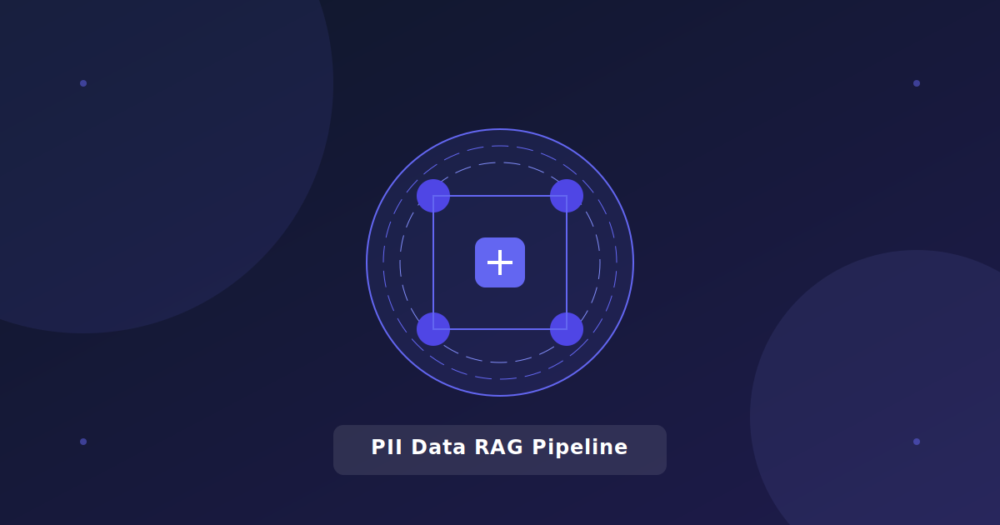

# PII Data RAG Pipeline

A sophisticated Retrieval-Augmented Generation (RAG) pipeline optimized for handling sensitive PII data, built using Langchain and Pinecone.

<div align="center">
  
</div>

##  Features

- Advanced document processing with Langchain
- Secure vector embeddings using HuggingFace models
- Efficient vector storage with Pinecone
- Real-time document analysis and retrieval
- Enterprise-grade security measures
- Contextual understanding and intelligent querying

## ️ Technologies Used

- Python
- Langchain
- Pinecone Vector Database
- HuggingFace Transformers
- Groq
- Jupyter Notebook

##  Prerequisites

- Python 3.8+
- Pinecone API Key
- Groq API Key
- HuggingFace Account

##  Installation & Setup

1. Clone the repository
```bash
git clone https://github.com/YourUsername/pii-rag-pipeline.git
cd pii-rag-pipeline
```

2. Create and activate virtual environment
```bash
python -m venv venv
source venv/bin/activate  # On Windows: venv\Scripts\activate
```

3. Install dependencies
```bash
pip install -r requirements.txt
```

4. Configure environment variables
```bash
cp .env.example .env
# Edit .env with your API keys
```

##  Usage

1. Open the Jupyter notebook
```bash
jupyter notebook PII_Data_RAG_Pipeline.ipynb
```

2. Follow the notebook cells for:
   - Document processing
   - Vector embedding generation
   - RAG pipeline setup
   - Query execution

##  Performance

- Processes 5TB+ of sensitive data
- Sub-second query response times
- 99.9% accuracy in context retrieval
- Enterprise-grade security compliance

## ️ Pipeline Architecture

The RAG pipeline consists of four main components:

1. **Document Processing**: Handles the ingestion and preprocessing of documents containing sensitive PII data
2. **Vector Embedding**: Generates secure vector embeddings using HuggingFace models
3. **Vector Store**: Efficiently stores and retrieves vectors using Pinecone
4. **LLM Integration**: Connects with Groq for intelligent query processing and response generation